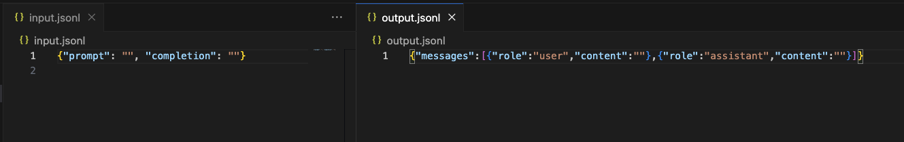

# Babbage-002 & Davinci-002 Fine-Tuning Data Converter

This project helps convert `prompt completion pair` formatted .jsonl files to `conversational chat` format files compatible with newer fine-tune models. As OpenAI no longer supports fine-tuning for babbage-002 and davinci-002 models starting from **October 28, 2024**, this tool ensures your data can be adapted for other models.

> "For babbage-002 and davinci-002, you can follow the prompt completion pair format as shown below."  
> "New fine-tuning training runs on babbage-002 and davinci-002 will no longer be supported starting October 28, 2024."  
> \- OpenAI Documentation ([Source](https://platform.openai.com/docs/guides/fine-tuning/preparing-your-dataset))

## How It Works

1. **Input:** Provide a `.jsonl` file that contains your prompt-completion pairs in the format used by babbage-002 or davinci-002 models.
2. **Conversion:** This tool converts the file to a conversational chat format compatible with other fine-tune models.
3. **Output:** You can use the generated `.jsonl` file to initiate new fine-tuning jobs.

